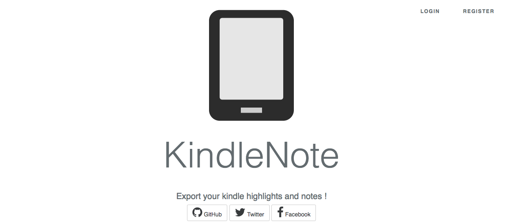

# KindleNote


**KindleNote**可以导出您**Kindle**中的**标注**与**笔记**，并支持将它们转换为**MarkDown**文件。

或者，您也可以选择将导出的**标记**与**笔记**存储于**KindleNote**的服务器中。

基于**PHP7**与**Laravel**框架构建。
## 架构
遵循**MVC**与**Restfull**。
## 使用

**KindleNote**的核心是**Clipping**，其路径为**/app/Clipping.php**。

您可以将**Clipping**提取出来单独使用，也可以选择**KindleNote**作为**WEB应用程序**来使用。

### Cliping
**Clipping**是一个**类**，封装了对**Kindle**剪贴文件的操作，如*解析笔记*、*导出为MarkDown*等。
示例如下：
```
// given a string containing the path of clipping file
$clippingDemo = new Clipping('clippingFilePath');

// parse
$clippingDemo->parse();

// export to markdown
$clippingDemo->exportToMarkdown('kindeNote.markdown');
```
### WEB应用程序
使用这种方式运行**KindleNote**，您需要在服务器中配置**HTTP服务器**、**数据库**等，并且可能需要使用**Composer**与**Npm**安装依赖的程序包。

##版权##
本软件遵循**GPL (GNU GENERAL PUBLIC LICENSE，*GNU通用公共许可证*)**。